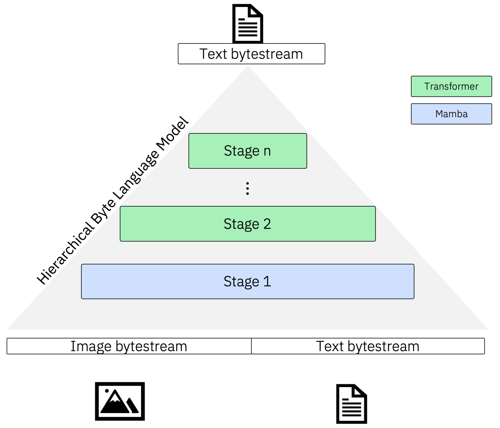

# Multiscale Byte Language Model

Multiscale Byte Language Model is a hierarchical byte-level sequence-to-sequence model for multimodal tasks.

<p align="center">
    
</p>

## Install

Install from PyPI:

```
pip install mblm
```

For `uv`:

```
uv add mblm
```

Available extras:

- `'mblm[analysis]'`: Installs with a handful of packages used inside `mblm.analysis`

### Using Torch and Mamba

You will need to **install a recent version PyTorch manually**. We use `>=2.4.1`. It is best to do this after installing the package since some sub-dependencies might install their own (CPU) PyTorch version.

```
uv pip install 'torch>=2.4.1' --index-url https://download.pytorch.org/whl/cu124
```

Finally, in order to use the efficient [Mamba-SSM](https://github.com/state-spaces/mamba), follow their instructions on the homepage. You'll need Linux and a GPU available during installation.

```
uv pip install mamba-ssm>=2.2.2 causal-conv1d>=1.4.0 --no-build-isolation
```

If `mamba-ssm` is not available, we fall back to using `mambapy`, which is written in pure PyTorch.

## Quickstart

### Using a built-in stage block

MBLM can be used with the default Transformer Decoder or Mamba block. The below model is a 2D MBLM with a global Mamba and local Transformer model.

```py
import torch

from mblm import MBLM, MambaBlockConfig, MBLMModelConfig, TransformerBlockConfig

mblm = MBLM(
    MBLMModelConfig(
        num_tokens=257,
        hidden_dims=[1024, 1024],
        seq_lens=[1024, 8],
        num_layers=[5, 5],
        pad_token_id=256,
        train_checkpoint_chunks=None,
        block=[
            MambaBlockConfig(
                d_state=128,
                d_conv=4,
                expand=2,
                headdim=64,
                pos_emb_type=None,
            ),
            TransformerBlockConfig(
                attn_head_dims=64,
                attn_num_heads=16,
                attn_use_rot_embs=True,
                use_flash_attn=True,
                pos_emb_type="fixed",
            ),
        ],
    )
)

x = torch.randint(0, 258, (1, 12)).long()
mblm.forward(x)
```

Alternatively, you can read configuration from a YAML string (or file):

```py
import torch
import yaml

from mblm import MBLM, MBLMModelConfig

yml_model_config = """
num_tokens: 257
hidden_dims: [1024, 1024]
seq_lens: [1024, 8]
num_layers: [5, 5]
pad_token_id: 256
train_checkpoint_chunks: null
block:
    - d_state: 128
      d_conv: 4
      expand: 2
      headdim: 64
      pos_emb_type: null
    - attn_head_dims: 64
      attn_num_heads: 16
      attn_use_rot_embs: true
      use_flash_attn: true
      pos_emb_type: fixed
"""

parsed_config = yaml.safe_load(yml_model_config)
mblm = MBLM(MBLMModelConfig.model_validate(parsed_config))
x = torch.randint(0, 258, (1, 12)).long()
mblm.forward(x)
```

### Custom stage blocks

You can define custom stage blocks for MBLM as follows. A stageblock must provide a `block_type` field as well as a `to_model` function with the signature below that returns a `torch.nn.Module`. Other than that, specify whatever other parameters you might need. Note that the default blocks (Transformer and Mamba) are already registered.

```py
import torch
from pydantic import BaseModel, Field

from mblm import MBLM, MBLMModelConfig, StageBlock, TransformerBlockConfig

# Define any custom model
class MyLSTM(torch.nn.Module):
    def __init__(self, lstm: torch.nn.LSTM):
        super().__init__()
        self.lstm = lstm

    def forward(self, input_ids: torch.Tensor) -> torch.Tensor:
        # Wrap the LSTM forward to extract the output
        out, _ = self.lstm(input_ids)
        return out

# Add a block config and inherit from StageBlock and BaseModel
class LSTMBlockConfig(StageBlock, BaseModel):
    block_type: str = Field(init=False, default="lstm")

    # Add whatever is needed
    dropout: float

    def to_model(self, model_dim: int, num_layers: int) -> torch.nn.Module:
        return MyLSTM(
            torch.nn.LSTM(
                input_size=model_dim,
                hidden_size=model_dim,
                batch_first=True,
                dropout=self.dropout,
                num_layers=num_layers,
            )
        )

mblm = MBLM(
    MBLMModelConfig(
        num_tokens=257,
        hidden_dims=[1024, 1024],
        seq_lens=[1024, 8],
        num_layers=[5, 5],
        pad_token_id=256,
        train_checkpoint_chunks=None,
        block=[
            LSTMBlockConfig(
                dropout=0.1,
                pos_emb_type=None,
            ),
            TransformerBlockConfig(
                attn_head_dims=64,
                attn_num_heads=16,
                attn_use_rot_embs=True,
                use_flash_attn=True,
                pos_emb_type="fixed",
            ),
        ],
    )
)

x = torch.randint(0, 258, (1, 12)).long()
mblm.forward(x)
```

If you want to parse a YAML config to a custom block, **register the block** before creating the model:

```py
import torch
import yaml
from pydantic import BaseModel, Field

from mblm import MBLM, MBLMModelConfig, StageBlock, block_registry

# Define any custom model
class MyLSTM(torch.nn.Module):
    def __init__(self, lstm: torch.nn.LSTM):
        super().__init__()
        self.lstm = lstm

    def forward(self, input_ids: torch.Tensor) -> torch.Tensor:
        # Wrap the LSTM forward to extract the output
        out, _ = self.lstm(input_ids)
        return out

# Add a block config and inherit from StageBlock and BaseModel
class LSTMBlockConfig(StageBlock, BaseModel):
    block_type: str = Field(init=False, default="lstm")

    # Add whatever is needed
    dropout: float

    def to_model(self, model_dim: int, num_layers: int) -> torch.nn.Module:
        return MyLSTM(
            torch.nn.LSTM(
                input_size=model_dim,
                hidden_size=model_dim,
                batch_first=True,
                dropout=self.dropout,
                num_layers=num_layers,
            )
        )

yml_model_config = """
num_tokens: 257
hidden_dims: [1024, 1024]
seq_lens: [1024, 8]
num_layers: [5, 5]
pad_token_id: 256
train_checkpoint_chunks: null
block:
    - dropout: 0.1
      pos_emb_type: null
    - attn_head_dims: 64
      attn_num_heads: 16
      attn_use_rot_embs: true
      use_flash_attn: true
      pos_emb_type: fixed
"""

block_registry.register(LSTMBlockConfig)  # Add this!

parsed_config = yaml.safe_load(yml_model_config)
mblm = MBLM(MBLMModelConfig.model_validate(parsed_config))
x = torch.randint(0, 258, (1, 12)).long()
mblm.forward(x)
```

## Local development setup

We use `uv` for packaging and dependency management. Before proceeding, install a recent version (>= `0.5`) via the instructions on [the homepage](https://docs.astral.sh/uv/getting-started/installation/).

### Install dependencies

- With CUDA: `make install_cuda`
- CPU only (e.g., MacOS): `make install_cpu`

If you've noticed, there are two SSM/Mamba dependencies:

- `mambapy`, defined in `pyproject.toml`
- `mamba-ssm` (with `causal-conv1d`), defined in `Makefile`

Because the official Mamba implementation `mamba-ssm` requires a Linux machine and a GPU available during installation, we shim the dependencies. `mambapy` is used as a fallback for all unsupported platforms or when `mamba-ssm` is not installed. Because `mamba-ssm` is so delicate, it needs to be installed manually:

```sh
make install_mamba
```

For any experiments, we wish to use the new Mamba 2 block from `mamba-ssm`. If the import of this module fails, we fall back to a Mamba 1 block from `mambapy`, which is written in pure PyTorch.

## Running scripts

- Project-related tasks (e.g., installing dependencies, running tests) are defined in the [Makefile](Makefile)

## Pre-Commit Hooks

Before every commit, we lint the _staged_ Python and Jupyter Notebook files and check if they are formatted correctly. Doing this locally speeds up development because one does not have to wait for the CI to catch issues. Errors of these checks are not fixed automatically, instead, you will have to fix the files yourself before committing. You may bypass hooks with `git commit -m <message> --no-verify`. However, the CI will likely fail in this case.

All Pre-commit hooks can be run manually as well:

- `pre-commit run lint`
- `pre-commit run check-format`

Note that:

- The `lint` command is similar to the `make lint` command, but the `make` command operates on _all_ files in the project and not just the staged files
- While `check-format` simply _checks_ the format, `make format` will _actually_ format the files

## Citation

TBD.
